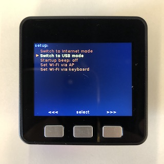

# vscode-m5stack-mpy

A extension for M5Stack Micropython system.

## Features

- Write/Read files in M5Stack Device
- Syntax-highlighting
- Snippet
- Auto Completion
- Debugging

## Quick Start

- Install vscode-m5stack-mpy.
- Set M5Stack(UIFlow) in USB Mode.



- Click "Add M5Stack device" and select the correct serial port of M5Stack.


- Open M5Stack file tree. If Device resets, please click the refresh button to reopen the file tree.


- Editor a file.


- Run in M5Stack.


- Save file. You can press `ctrl + s` or click `File->Save` to save file.


## Uncompleted

- Auto Completion of Units and Modules.
- Display tips when hover on it.

## Contributions

To verify changes of this plugin you build the plugin with

```
git clean -fdX
yarn cache clean
yarn
```

Then you start vscode with this directory as argument like this

```
code ./
```

Then you hit F5 and verify that it works.
See more on https://code.visualstudio.com/api
